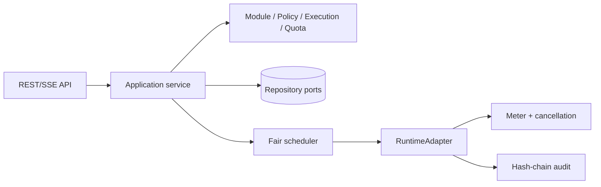

# WASM Sandbox Runtime

纯 Go 1.23 多租户 WebAssembly 沙箱任务平台。默认 `go-safe-simulator` 适配器只解释输入并生成结构化结果，不执行宿主代码；真实 Wasmtime/Wazero 适配器可通过 `RuntimeAdapter` 注入。

## 快速启动

```bash
go run ./cmd/sandboxd
curl http://localhost:8087/healthz
```

配置可通过环境变量覆盖：`HTTP_ADDR`、`WORKERS`、`QUEUE_SIZE`、`DEFAULT_TIMEOUT`、`MAX_BODY_BYTES`、`LEASE_DURATION`。复制 `.env.example` 后再启动。

## API

- `POST/GET /api/v1/modules`，`POST /api/v1/modules/{id}/versions`
- `POST /api/v1/executions`，`GET /api/v1/executions/{id}`
- `POST /api/v1/executions/{id}/cancel|checkpoint`，`GET .../events` SSE
- `POST /api/v1/policies`，`GET/POST /api/v1/quotas`
- `GET /api/v1/runtime`，`GET /healthz`、`/readyz`、`/metrics`

每次执行要求 `tenant_id` 和 `module_version_id`，可设置 `idempotency_key`。执行由公平调度器租约给 worker，受 CPU 指令、线性内存、输出字节和超时限制。输入输出仅通过摘要和对象端口传递；日志默认脱敏。

## 架构



状态机：`queued -> admitted -> running -> checkpointed -> succeeded`；运行失败进入 `failed`，截止时间进入 `timed_out`，取消进入 `cancelled`，静态检查高风险进入 `quarantined`。模块生命周期为 `draft -> ready -> quarantined/revoked`。

## 安全与可靠性

WASM 检查器只读取 magic/version、section 长度、imports/exports、memory limits 和指令估算，拒绝畸形包、未知能力、超大内存和输出洪泛。策略编译器处理只读挂载、环境白名单、网络域名/CIDR 和 deterministic mode。配额预占具备释放幂等性；内存仓储接口可替换 PostgreSQL/Redis/Object Storage。

`docs/` 包含领域模型、时序、SLO、威胁模型、容量估算、灾备和故障演练；`api/openapi/openapi.yaml` 与 `api/proto/runtime.proto` 描述协议；`scripts/smoke.sh` 执行健康、模块、策略、配额和执行流程 smoke。

## 验证

```bash
gofmt -w $(find . -name '*.go')
go test ./...
go test -race ./...
go vet ./...
go build ./...
```
