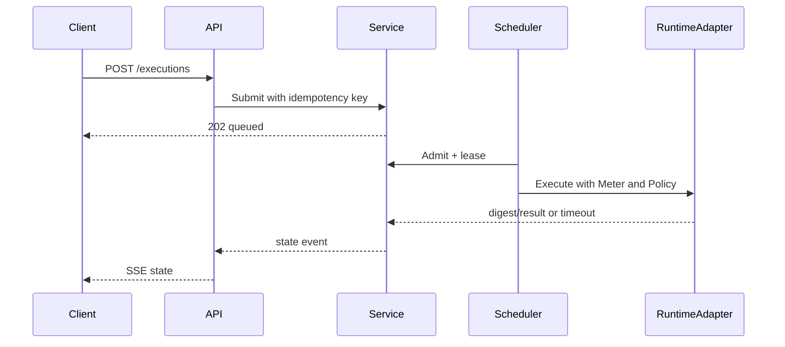

# Architecture

Transport owns HTTP decoding, request limits, SSE and error mapping. Application coordinates use cases and emits state events. Domain packages contain lifecycle invariants, capability policy, module schemas and quota reservation without transport or storage imports. Repository ports isolate persistence. Worker owns fair queue, worker leases and recovery. Runtime ports isolate a safe simulator from a future Wasmtime/Wazero adapter.

